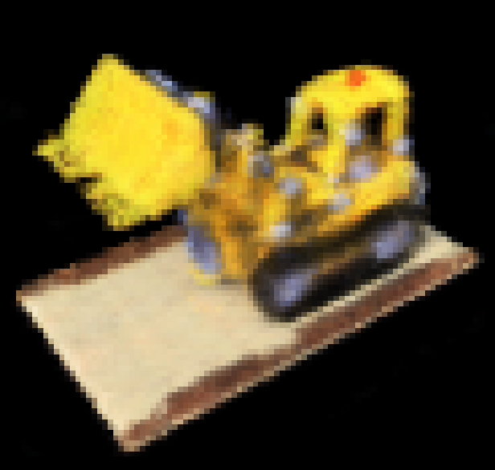
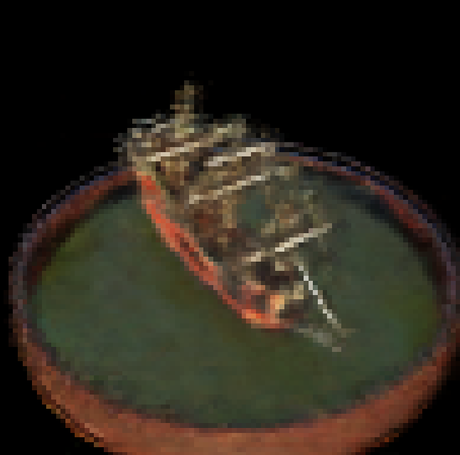
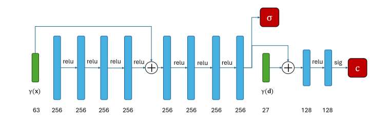

# Neural Radiance Fields (NeRF)

## Overview

This repository contains code for training and testing Neural Radiance Fields (NeRF). NeRF is a novel representation that synthesizes novel views of complex 3D scenes based on a partial set of 2D images of that scene. 

## Getting Started

### Prerequisites

Ensure you have Python and the necessary libraries installed. You can install the required packages using:

```bash
pip install -r requirements.txt
```

### Folder Structure

- `DATA`: This folder should contain the datasets you want to train the model on.
- `checkpoints`: This folder should contain the model checkpoints for testing.

### Training

To start training, place your dataset in the `DATA` folder and run the following command. Replace `<datasetname>` with the folder name of your dataset:

```bash
python nerf_wrapper.py --dataset "<datasetname>"
```

### Testing

To run the test code, specify the path to the desired model checkpoints and run the following command. Replace `<checkpoint_path>` with the actual path to your checkpoint file:

```bash
python test.py --model "<checkpoint_path>"
```

## Adding Images

You can insert images in the relevant sections below by pasting the image path and adding a description.

### Image 1



*NERF output for Lego database*

### Image 2



*NERF output for SHIP database*

### Image 3



*Network used in NERF*

## Citation

If you use this code in your research, please cite the relevant paper.

```
@article{mildenhall2020nerf,
  title={NeRF: Representing Scenes as Neural Radiance Fields for View Synthesis},
  author={Mildenhall, Ben and Srinivasan, Pratul P and Tancik, Matthew and Barron, Jonathan T and Ramamoorthi, Ravi and Ng, Ren},
  journal={ECCV},
  year={2020}
}
```

## License

This project is licensed under the MIT License - see the [LICENSE](LICENSE) file for details.

---

For any questions or issues, please open an issue in this repository or contact the authors.

